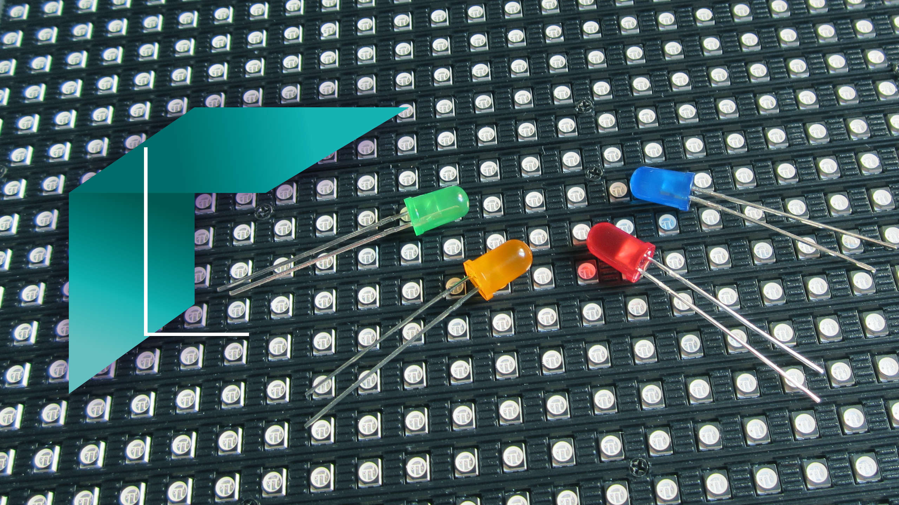

% Enseignes et afficheurs à LED
% Plan du MOOC
% [Pierre-Yves Rochat](mailto:pyr@pyr.ch), EPFL

Version de travail du 2017/03/22

**Enseignants** : (YT) : Yves Tiecours, (AT) Alain Tiedeu, (MLN) Mamadou Lamine Ndiaye, (PYR) Pierre-Yves Rochat.

**Documents** : Les notes de cours sont disponibles en HTML et en PDF. Les dispositives sont en PDFen version compacte.

**Domaines** : Le cours introduit progressivement des sujets en *électronique* et en *microcontrôleur*, pour apprendre à concevoir des enseignes et des afficheurs à LED. En parallèle, un cours de *circuits logiques* est donné, pour mener à la réalisation de commande d'afficheurs complexes utilisant des FPGA. En plus, quelques sujets de *physique* sont proposés.

## Semaine 1 ##

**1.1** **Clair 2018**  (YT)     

## Semaine 2 ##

**2.2** **Le transistor**  (YT)  [cours-html](../202/transistor.html) [cours-pdf](../202/transistor.pdf) [dias-compact](../202/transistor-dia-compact.pdf)   

## Semaine 5 ##

**5.1** **Les Interruptions**  (YT)  [cours-html](../501/inter.html) [cours-pdf](../501/inter.pdf) [dias-compact](../501/inter-dia-compact.pdf)   