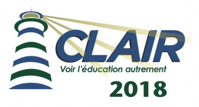
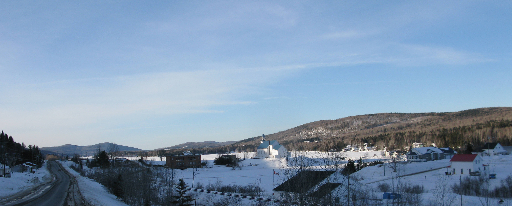
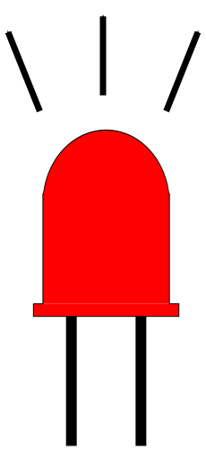
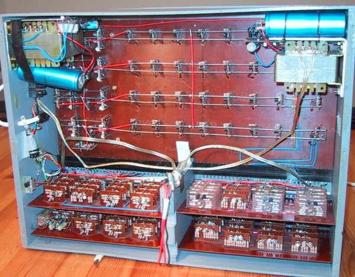
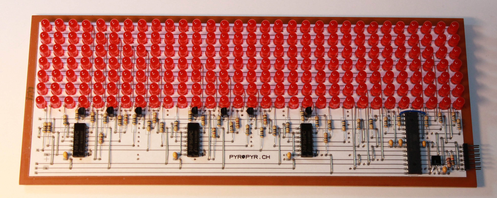
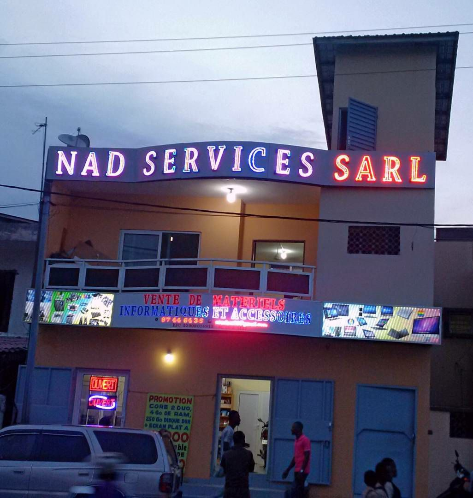
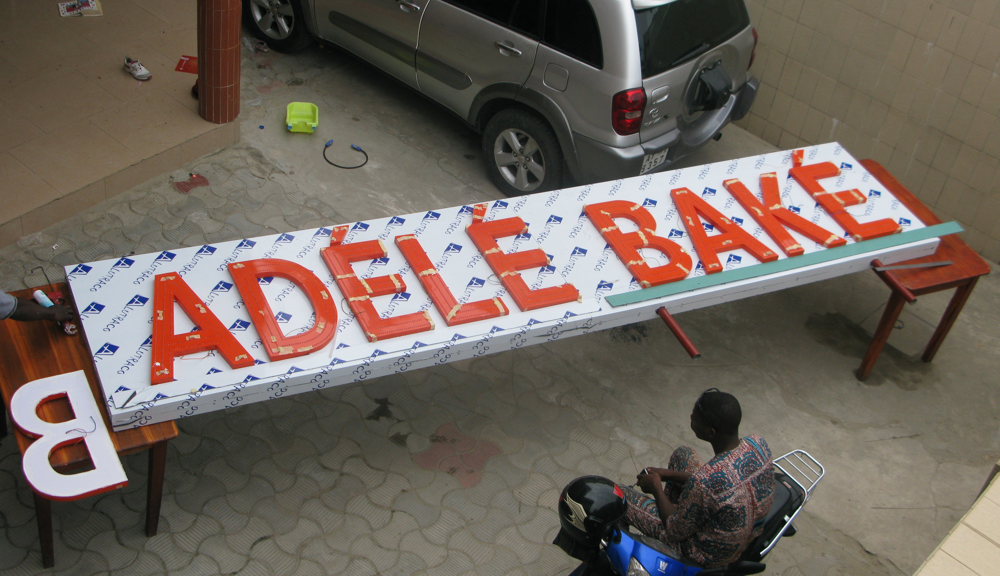

<!-- DIAPORAMA -->

<!-- Page de titre -->
<section class="page_de_garde">

Du club d'électronique au MOOCs

Un témoignage de Pierre-Yves Rochat,

chargé de cours à l'

</section>

<section>
<!-- def A -->
<!-- def A -->

<!-- def A -->**Clair 2018** Du club d'électronique au MOOCs
<!-- def A -->

<!-- def A -->
<!-- A -->
<h1 class="en_tete">Tout a commencé en 1948</h1>
<!-- 2345 -->
<!-- 345 -->

<!-- 345 -->* L'invention du transistor !
<!-- 45 -->* A mon avis, l'invention majeure du 20ème siècle
<!-- 345 -->

<!-- 5 -->

<!-- 5 -->* Vos clés USB ou les cerveaux de vos robots mobiles
<!-- 5 -->* Google ou l'intelligence artificielle
<!-- 5 -->* Vos téléphones et les freins de vos voitures
<!-- 5 -->* ... tout ça fonctionne avec des transistors !
<!-- 5 -->

</section>

<section>
<!-- A -->
<h1 class="en_tete">La Silicon Valley</h1>
<!-- 23456789 -->

<!-- 23456789 -->* Pourquoi cette technologie s'est-elle développée à la Silicon Valley ?
<!-- 3456789 -->* En 1939 Frederick Terman est enseignant dans l'université Stanford.
<!-- 3456789 -->* Ses étudiants ne trouvent pas de travail, il décide d'agir.
<!-- 3456789 -->* Il cherche a convaincre ses étudiants de lancer leurs entreprises.
<!-- 456789 -->* ... comme  par exemple William Hewlett et son ami David Packard.
<!-- 23456789 -->

<!-- 56789 -->
<!-- 6789 -->

<!-- 6789 -->* En 1955, Terman donne de l’université aux entreprises autour du campus.
<!-- 789 -->* Shockley, co-inventeur du transistor installe un labo dans la région
<!-- 89 -->* Les ingénieurs des Bell Labs refusent de quitter l'est des Etats Unis.
<!-- 89 -->* Shockley engage des jeunes ingénieurs de Stanford, dont un certain Gordon Moore..
<!-- 6789 -->

<!-- 9 -->
</section>

<section>
<!-- A -->
<h1 class="en_tete">1957 !</h1>

* C'est vers 1957 que les transistors deviennent des composants industriels.
<!-- 234 -->* On les utilise pour fabriquer des *transitors*

<!-- 34 -->
<!-- 4 -->

<!-- 4 -->* ... et accessoirement ma naissance, à Lausanne, en Suisse romande.
<!-- 34 -->

<!-- 4 -->
</section>

<section>
<!-- A -->
<h1 class="en_tete">Suisse romande</h1>

* La Vallée de Joux, dans le Jura vaudois, où est né mon père

<!-- 2 -->
<!-- 2 -->

<!-- 2 -->* Lac Backer, dans le Nouveau Brunswick, où je loge ces jours-ci
<!-- 2 -->

</section>

<section>
<!-- A -->
<h1 class="en_tete">Travaux manuels</h1>

* Mon père est bricoleur.
* Il a des outils pour travailler le bois.
<!-- 234 -->* Je reçois une scie à découper pour Noël.
<!-- 234 -->* Lego et Mecano font partie de mes jouets.

<!-- 34 -->

<!-- 34 -->* Les travaux manuels : une tradition de l'école vaudoise.
<!-- 34 -->

<!-- 4 -->
</section>

<section>
<!-- A -->
<h1 class="en_tete">Le club d'électronique</h1>

* Vers l'âge de 12 ans, un ami me parle d'un club d'électronique.
<!-- 234 -->* Des jeunes se retrouvent le mercredi après-midi.
<!-- 234 -->* Des passionnée, des enseignants viennent nous donner de cours.
<!-- 234 -->* On peut acheter des composants, on nous aide de réaliser des montages.

<!-- 34 -->

<!-- 34 -->* Le fondateur est Jean-Daniel Nicoud.
<!-- 34 -->* Il avait reçu peu de temps avant mille transistors.
<!-- 4 -->* Il construit une calculatrice de moyennes pour son école
<!-- 4 -->* Il associe les jeunes à ses créations.
<!-- 34 -->

<!-- 34 -->
</section>

<section>
<!-- A -->
<h1 class="en_tete">Le club d'électronique</h1>

* Je me souviens de la première fois que je vois une LED.
<!-- 3456 -->* On rêve d'en couvrir un mur
<!-- 3456 -->* et d'en faire une télévision plate géante !
<!-- 3456 -->* Les _plus grands_ nous ramènent à la réalité

<!-- 23456 -->
<!-- 456 -->

<!-- 456 -->* Un concours est organisé régulièrement.
<!-- 56 -->* Chacun apporte son montage, des prix sont distribués.
<!-- 6 -->* Ici, un jeu de Nim, qui est même allé aux USA.
<!-- 456 -->

<!-- 5 -->
<!-- 6 -->
</section>

<section>
<!-- A -->
<h1 class="en_tete">Choix d'un métier</h1>

* Je rêve de devenir ingénieur.
<!-- 23456 -->* A l’École Polytechnique Fédérale de Lausanne ?
<!-- 3456 -->* Jean-Daniel Nicoud y travaille, il dirige un laboratoire.
<!-- 3456 -->* C'est là que la souris telle qu'on la connaît est née.

<!-- 2 -->
<!-- 3 -->
<!-- 456 -->
<!-- 56 -->

<!-- 56 -->* Je fais mes études d'ingénieur électricien à l'EPFL entre 1975 et 1980.
<!-- 6 -->* Est-ce qu'une passion peur devenir un métier ?
<!-- 56 -->

</section>

<section>
<!-- A -->
<h1 class="en_tete">Famille</h1>

* Je me marie entre les examens finaux et mon travail de diplôme.
<!-- 23 -->* Un premier fils arrive 10 mois plus tard..
<!-- 3 -->* A 28 ans, j'ai quatre enfants.

<!-- 12 -->
<!-- 3 -->
</section>

<section>
<!-- A -->
<h1 class="en_tete">Trouver du travail</h1>

<!-- 2345 -->* Le chômage n'existe pas en Suisse en 1980.
<!-- 2345 -->* J'ai envie de travailler à mon compte.
<!-- 345 -->* Je décide de créer mon Bureau d'ingénieurs.
<!-- 345 -->* Pas besoin d'investir. J'ai déjà mon petit atelier d'électronique.

<!-- 456 -->

<!-- 456 -->* Je ne suis pas préparé à créer mon entreprise !
<!-- 56 -->* C'est bien plus tard que l'EPFL aura un Collège des humanités.
<!-- 6 -->* Il faut préparer les jeunes à l'entrepreneuriat, depuis l'école...
<!-- 456 -->

<!-- 12 -->
<!-- 6 -->
</section>

<section>
<!-- A -->
<h1 class="en_tete">Activités pour les jeunes</h1>
</section>

<section>
<!-- A -->
<h1 class="en_tete">L'Afrique</h1>

* 1997 : deux semaines de vacances en famille au Togo.
<!-- 234 -->* La capitale Lomé, mais aussi une ville au nord du pays.

<!-- 2 -->
<!-- 345 -->

<!-- 345 -->* Les africains découvrent l'informatique, mais ne savent pas réparer les PC.
<!-- 45 -->* Je décide de me consacrer à enseigner ce domaine.
<!-- 5 -->* Je voyage dans plusieurs pays :
<!-- 5 -->* Bénin, Côte d'Ivoire, Burkina, Madagascar.
<!-- 345 -->

<!-- 4 -->
<!-- 45 -->
</section>

<section>
<!-- A -->
<h1 class="en_tete">Changement de cap, microcontrôleurs</h1>

* Après 10 ans de maintenance informatique, je décide de change de cap.
<!-- 23456 -->* Je vais enseigner les microcontrôleurs.

<!-- 3 -->
<!-- 456 -->
<!-- 456 -->

<!-- 56 -->* Tout l'ordinateur mis dans un circuit intégré.
<!-- 6 -->* Des applications innombrable !
<!-- 456 -->

</section>

<section>
<!-- A -->
<h1 class="en_tete">Entrepreneuriat</h1>

* Je me rapproche de l'enseignement supérieur. Je vais au Cameroun, au Congo, au Mali.
<!-- 23456 -->* Partout, je constate le chômage après les études. Il faut promouvoir l'auto-emploi.

<!-- 345 -->

<!-- 456 -->

<!-- 456 -->* Des micro entreprises voient le jour au Cameroun, en Côte d'Ivoire, au Bénin
<!-- 56 -->* Probablement les seules croix de pharmacie matricielles fabriquées en Afrique.
<!-- 456 -->

<!-- 6 -->
</section>

<section>
<!-- A -->
<h1 class="en_tete">Dominique</h1>

* Mon épouse Dominique était aussi passionnée que moi de l'Afrique.
* Elle a consacre plusieurs années à des projets caritatifs dans la petite ville de Bassar
* Soutien scolaire, dispensaire, prévention et soin de l'hypertension parmi les femmes âgées.

<!-- 23 -->

<!-- 23 -->* Elle tombe malade en août 2008
<!-- 23 -->* et décède une semaine plus tard à l'hôpital de Genève.
<!-- 23 -->

<!-- 3 -->
</section>

<section>
<!-- A -->
<h1 class="en_tete">Un MOOC</h1>

* De 2006 à 2012, j'estime avoir parlé des microcontrôleurs à environ mille étudiants africains.
<!-- 2345678 -->* Une occasion imprévue  va me donner l'occasion d'un second souffle :
<!-- 345678 -->* On me propose de faire un **MOOC** !

<!-- 45678 -->

<!-- 45678 -->* **Massive Open Online Course** :
<!-- 5678 -->* *__Course__* : un cours universitaire
<!-- 678 -->* *__Online__* : donné sur Internet
<!-- 78 -->* *__Open__* : ouvert à tous, gratuit
<!-- 8 -->* *__Massive__* : ... on n'est alors pas étonné que beaucoup souhaitent le suivre !
<!-- 45678 -->

</section>

<section>
<!-- A -->
<h1 class="en_tete">Plus qu'un cours en vidéo</h1>

* Un MOOC est plus qu'une collection de vidéos.

<!-- 234567 -->
<!-- 234567 -->

<!-- 34567 -->* Une progression en semaines, comme pour un cours universitaire.
<!-- 4567 -->* Des exercices, qui aident à l'assimilation.
<!-- 567 -->* Des évaluations qui permettent de voir le niveau atteint.
<!-- 67 -->* Un forum où les étudiants peuvent poser des questions, échanger entre eux.
<!-- 7 -->* Un certificat, qui atteste la participation à ceux qui terminent.
<!-- 234567 -->

</section>

<section>
<!-- A -->
<h1 class="en_tete">Comprendre les microcontrôleurs</h1>

* Je ne suis pas professeur...
<!-- 23456 -->* Jean-Daniel Nicoud est professeur honoraire !

<!-- 3456 -->
<!-- 456 -->

<!-- 456 -->* En mai 2013 le projet est accepté
<!-- 56 -->* Enregistrement dès juillet
<!-- 6 -->* Le MOOC est ouvert en octobre
<!-- 6 -->* De milliers d'inscriptions !
<!-- 456 -->

</section>

<section>
<!-- A -->
<h1 class="en_tete">Une star planétaire...</h1>
<!-- 2 -->

<!-- 2 -->_À Lausanne, les quelques passionnés d’Afrique qui, pendant des années, ont autofinancé leurs voyages, sont désormais portés par la stratégie africaine de l’EPFL. C’est le cas de Pierre-Yves Rochat, 56 ans. Son Mooc a tellement d’inscrits en Afrique, où il passe trois mois par an, qu’il est une star de Thiès à Niamey, de Pointe-Noire à Kinshasa, reconnu à sa chemise à fleurs avant même son entrée dans l’auditoire._
<<!-- 2 -->/div>
<!-- 345 -->

<!-- 345 -->_... les MOOCs, dont les professeurs sont devenus de véritables star planétaires..._
<!-- 345 -->

<!-- 45 -->

<!-- 45 -->* Des témoignages nous arrivent de partout pour nous remercier, parfois très touchants.
<!-- 45 -->* "En tous cas tu n'imagines pas tout ce que le MOOC microcontrôleurs que tu as fait avec Jean-Daniel a pu changer dans ma vie, et je n'exagère pas."
<!-- 45 -->* "Je vous remercie pour toute l'aide que vous nous apportez et vos cours me remotivent à me remettre dans le bain depuis mon BTS électronique  il y a plus de 15 ans."
<!-- 45 -->* "Vous êtes un très grand pédagogue. Ma façon de donner cours à mes élèves a changé grâce à vous. Vous rendez tout simple et on évolue sans s'en rendre compte sur des concepts pourtant compliqués. Merci et je vous prie de continuer sur cette lancée. "
<!-- 45 -->* Je me fais même une fois insulter... parce que le MOOC n'est pas en anglais !
<!-- 45 -->

</section>

<section>
<!-- A -->
<h1 class="en_tete">Mille kits</h1>

* La pratique est au cœur de la compréhension.
<!-- 2345 -->* L’enseignement en Afrique se limite généralement à la théorique.
<!-- 345 -->* Les écoles n'ont pas de fonds pour du matériel pédagogique.

<!-- 45 -->* Je décide de proposer aux étudiants 
<!-- 45 -->* du matériel peu coûteux.

<!-- 5 -->
</section>

<section>
<!-- A -->
<h1 class="en_tete">Studio MOOC</h1>

* Un  studio MOOCs disposent au moins
<!-- 234 -->* d'une caméra qui filme le professeur le professeur
<!-- 234 -->* d'un table devant laquelle se tient le professeur
<!-- 234 -->* d'un ordinateur avec une tablette graphique (type Wacom)
<!-- 234 -->* d'un éclairage pour le professeur
<!-- 234 -->* d'un fond blanc
<!-- 234 -->* d'un éclairage pour le fond blanc
<!-- 234 -->

<!-- 34 -->
<!-- 4 -->

<!-- 4 -->* 2 flux doivent à enregistrer
<!-- 4 -->* la tablette et la caméra.
<!-- 4 -->

</section>

<section>
<!-- A -->
<h1 class="en_tete">Studio "home made"</h1>

* Besoin de petites vidéos très pratiques
<!-- 23 -->* Je monte un petit studio dans mon bureau

<!-- 3 -->
</section>

<section>
<!-- A -->
<h1 class="en_tete">Faire connaître les MOOCs en Afrique</h1>

* Dans plusieurs pays, je fais connaître les MOOCs
* Après des étudiants et des enseignants.
<!-- 23 -->* Formations pour des professeurs d'université
<!-- 3 -->* pour utiliser, mais aussi produire des MOOCs.

<!-- 3 -->
</section>

<section>
<!-- A -->
<h1 class="en_tete">MOOCs for Africa</h1>

* 11 universités d’Afrique sub-Saharienne associées au programme
* Plus de 65 enseignants et techniciens africains formés à l’EPFL à la production des MOOCs
* 2 MOOC Factories créés en Afrique (centres de compétences techno-pédagogiques)
* 51 MOOCs produits ou co-produits, dont 35 sont intégrés aux cursus des partenaires africains
* 14 MOOCs collaboratifs produits par 74 enseignants de 22 institutions du Nord et du Sud
* Plus de 220’000 africains inscrits aux MOOCs de l’EPFL
* Plus de 3’500 ont obtenu des certificats par les  plateformes Coursera et edX
* Concept de _Certificates of Open Studies_ (COS) validé et inscrit dans l’offre de l’EPFL
* Accord avec l’AUF pour la tenue d’examens dans les 37 Campus Numériques Francophone

</section>

<section>
<!-- A -->
<h1 class="en_tete">Un MOOC pour l’entrepreneuriat</h1>

* Après avoir réalisé un MOOC vient l'envie d'en créer d'autres !
<!-- 2345 -->* Deux idées m'ont guidé pour le choix du sujet :
<!-- 2345 -->* faire un MOOC collaboratif avec des professeurs africains
<!-- 2345 -->* proposer un MOOC qui stimule l’entrepreneuriat.

<!-- 345 -->

<!-- 345 -->* Le RESCIF appel à candidature pour des MOOCs collaboratifs entre les écoles
<!-- 345 -->* Je trouve un professeur ivoirien
<!-- 345 -->* L'EPFL me trouve un sénégalais et un camerounais
<!-- 345 -->

<!-- 45-->

<!-- 45 -->* La dernière leçon parlera des Murs de LED, dont j'avais rêvé 40 ans auparavant !
<!-- 45 -->

<!-- 5 -->
</section>

<section>
<!-- A -->
<h1 class="en_tete">MOOC made in Africa</h1>

* L'EPFL a de beaux studios MOOCs, mais je rêve d'enregistrer en Afrique !
<!-- 23 -->* Par petits pas, je monte un studio à Yamoussoukro, en Côte d'Ivoire.

<!-- 3 -->
</section>

<section>
<!-- A -->
<h1 class="en_tete">Cotonou</h1>

* La vie continue... Voici Nadège, mon épouse, avec nos deux aînés :

<!-- 34 -->

<!-- 34 -->* et le petit dernier !
<!-- 34 -->

<!-- 23 -->
<!-- 34 -->
<!-- 34 -->

<!-- 4 -->* Les familles de Suisse et de Cotonou :
<!-- 4 -->

<!-- 4 -->
</section>

<section>
<!-- A -->
<h1 class="en_tete">Nad Service</h1>

* Ma femme a aussi l'esprit d'entrprise.
* Elle fonde Nad Service et fabrique des enseignes et afficheurs.

<!-- 23 -->
<!-- 34 -->
<!-- 4 -->
</section>
